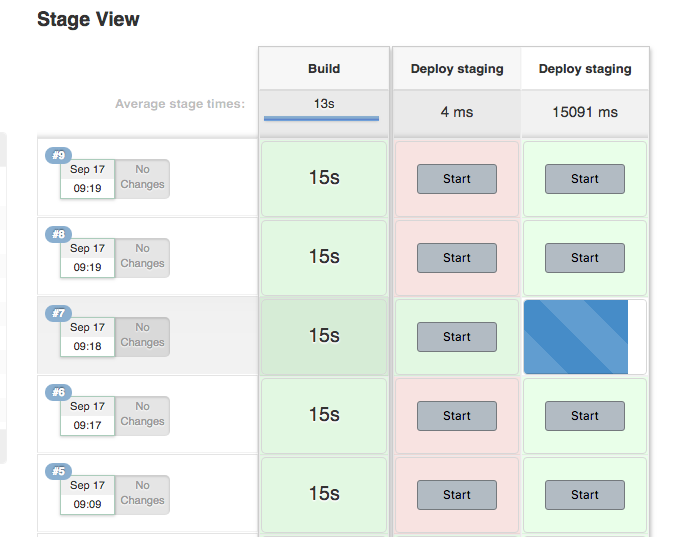

### Purpose

This plugins was created as enhancement for trunk base development in jenkins pipeline.
Main idea is very simple: ability to execute additional pipelines after main pipeline is completed on push button. 
Plugin is integrated with 
[Pipeline Stage View Plugin](https://wiki.jenkins.io/display/JENKINS/Pipeline+Stage+View+Plugin) 
to provide nice manageable view of all available jobs and addons. Even if main purpose of this plugin is to 
enable trunk based development, it is also very flexible and may serve for other purposes.

### Use cases
* If Your development, testers or analysis team want to manually approve deployments to production or UAT environments.
* If You want to have ability to redeploy same artifact on any environment. For testing or maybe emergency purposes.
* If You have any repeated jobs that should be done after your deployments and are coupled to every single pipeline 
execution (build).

### Syntax
You can define addons to your pipeline calling function `jobAddon` with `name` and `id` parameters where:
* **name** is name of the build which will be displayed in UI
* **job** is id of job which should be executed as addon

### Example
```groovy
node {
    stage('Build') {
        //some actions
    }
    stage('Test') {
        //some actions
    }
    jobAddon(name:'Deploy staging', id:'deploy-stage')
    jobAddon(name:'Deploy production', id:'deploy-prod')
}
```
Also you have to define pipelines **deploy-stage** and **deploy-prod** in this case, in other case your build will 
fail.

Example stage view will look like this:
